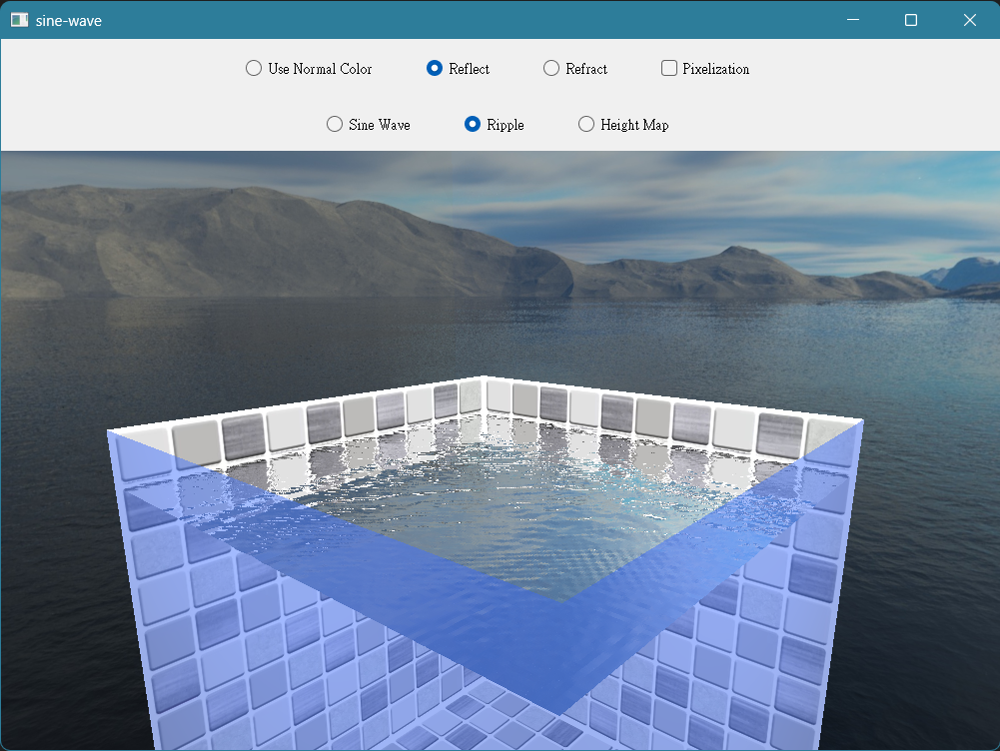

# How to use

按住滑鼠右鍵並拖動可以移動視角。點擊滑鼠左鍵可以和水面互動（要勾選上方的Ripple）。

# How to build

1. 以Qt Creator開啟CMakeLists.txt
2. 選擇Toolkit（建議使用Qt 5.15.2）
3. 按左下角的執行

# CACHE Variable

下表為Configure時可以修改的CACHE Variable

|Name | Description|
|---- | -----------|
|QT_MAJOR_VERSION| Qt的主版本（5或6），預設為5